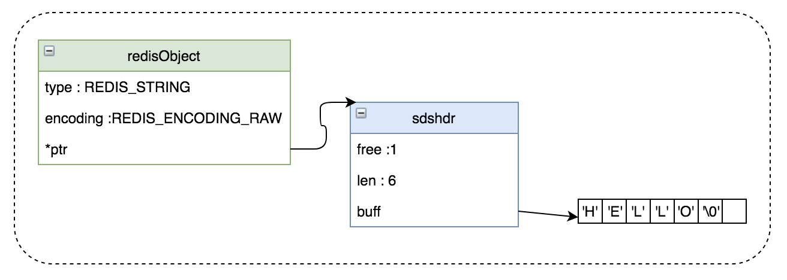
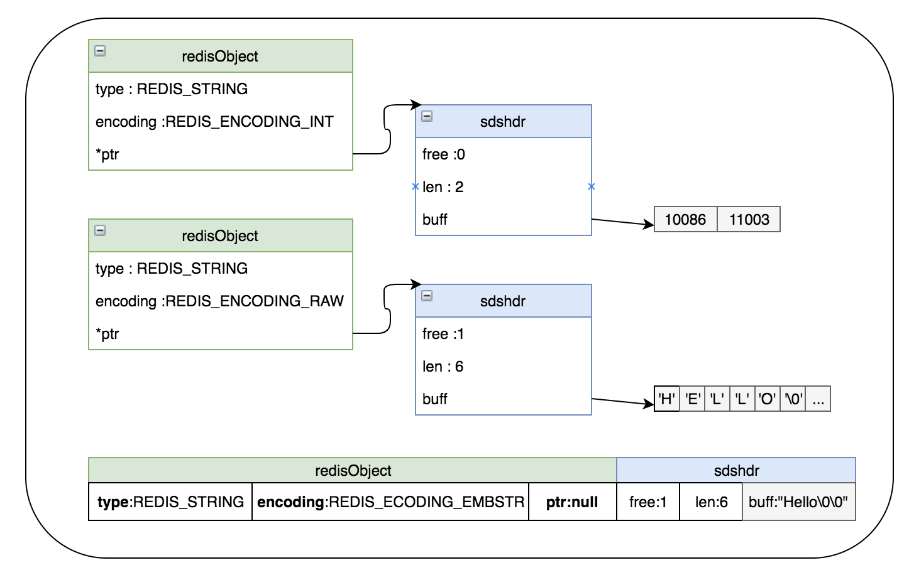
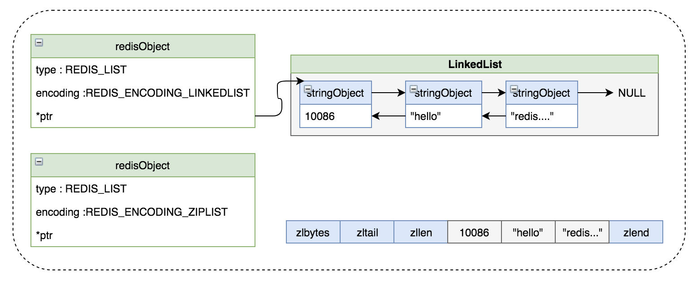

---
layout:     post
title:      "REDIS系列之五大对象实现原理"
subtitle:   ""
date:       2017-12-01 12:00:00
author:     "Tango"
header-img: "img/in-post/post-2017-10-11/post-bg-universe.jpg"
catalog: true
tags:   
    - REDIS
    - key-value
    - 缓存  
---  

Redis并没有采用上文介绍的底层数据结构实现键值对数据库，而是基于底层数据结构实现一套对象系统,包括字符串对象、链表对象、哈希对象、集合对象、排序集合对象。而且，每个对象的底层实现至少存在两种,针对不同的应用场景可以选择不同的实现方式,从而提高效率。

## 1.对象系统
Redis是key-value数据库,每创建一个键值对就会创建两个对象，即一个键对象，一个值对象。Redis中默认键是string对象，值是redisObject对象。其结构如下:  

```
typedef struct redisObject{
   
   //类型
   unsigned int type:4;
   
   //编码
   unsigned int encoding:4;
   
   //底层实现数据结构指针
   void* ptr;
}
```
其内存结构如图所示:


其中类型`type`如下:

|类型常量|对象名称|
|:---|:----|
|REDI_STRING|字符串对象|
|REDIS_LIST|列表对象|
|REDIS_HASH|哈希对象|
|REDIS_SET|集合对象|
|REDIS_ZSET|有序集合对象|

`encoding`如下:  

|编码常量|底层数据结构|
|:--:|:--:|
|REDIS_ENCODING_INT|long型整数|
|REDIS_ENCODING_EMBSTR|embstr编码简单动态字符串|
|REDIS_ENCODING_RAW|简单动态字符串|
|REDIS_ENCODING_HT|字典|
|REDIS_ENCODING_LINKEDLIST|双端链表|
|REDIS_ENCODING_ZIPLIST|压缩列表|
|REDIS_ENCODING_INTSET|整数集合|
|REDIS_ENCODING_SKIPLIST|跳跃表和字典|

下表表示不同类型和编码的对象:  

|类型|编码|对象|
|---|---|---|
|REDIS_STRING|REDIS_ENCODING_INT| 整数值实现字符串对象|
|REDIS_STRING|REDIS_ENCODING_EMBSTR| embstr编码实现简单动态字符串|
|REDIS_STRING|REDIS_ENCODING_RAW| 简单动态字符串实现字符串对象|
|REDIS_LIST|REDIS_ENCODING_ZIPLIST| 压缩列表实现列表对象|
|REDIS_LIST|REDIS_ENCODING_LINKEDLIST| 双端链表实现列表对象|
|REDIS_HASH|REDIS_ENCODING_ZIPLIST| 压缩列表实现的哈希对象|
|REDIS_HASH|REDIS_ENCODING_HT| 字典实现的哈希对象|
|REDIS_SET|REDIS_ENCODING_INTSET| 整数集合实现的集合对象|
|REDIS_SET|REDIS_ENCODING_HT| 字典实现的集合对象|
|REDIS_ZSET|REDIS_ENCODING_ZIPLIST| 压缩列表实现的有序集合对象|
|REDIS_ZSET|REDIS_ENCODING_SKIPLIST|跳跃表和字典实现的有序集合对象 |

从上表可以看出任意一种对象都**至少有两种实现方式**。

`OBJECT ENCODING `命令显示对象的编码类型  

  ``` 
   redis>set msg "hello world"     
   redis>OBJECT ENCODING msg
         "embstr" 
  ```

## 2.字符串对象
字符串对象有int、raw、embstr三种编码方式,其底层数据结构三个原则:  

- 如果字符串对象保存的是**整数值**,并且这个整数值可以用long型数据表示，则底层数据采用**int型编码**
- 如果字符串对象保存的是一个**字符串值**，并且这个字符串的**长度大于32个字节**，那么字符串对象将使用一个简单动态字符串(SDS)保存，即编码方式采用**raw.**
- 如果字符串对象保存的是一个**字符串值**，并且这个字符串的**长度小于于32个字节**，那么字符串对象将使用**embstr字符串保存(连续一块内存)**，即编码方式采用**embstr**.
如图是三种编码方式内存结构:


字符串常用命令:  

|命令|功能|说明|
|---|---|----|
|SET|保存字符串值||
|Get|获取字符串值||
|APPEND|追加字符串到末尾||
|INCRBYFLOAT|对浮点数进行加法运算|Increase By Float|
|INCRBY|对整数进行加法运算||
|DECRBY|对整数进行减法运算||
|STRLEN|返回字符串长度||
|SETRANGE|将字符串特定索引上单值设置为给定的字符||
|GETRANGE|直接取出并返回字符串指定索引上的字符||


## 3.列表对象
列表对象ziplist、linkedlist两种编码方式，其底层数据结构采用编码方式的原则:  
  
- 列表对象保存的 所有字符串元素的**长度都小于64字节**时,**采用ziplist编码**
- 列表对象保存的**元素数量小于512个**时，采用**ziplist**编码  
- **不满足上述条件其他情况**,都采用**linkedlist**编码方式。  

其内存结构如下图所示:  


列表常用命令如下:  

|命令|功能|说明|
|---|---|---|
|LPUSH|将元素压入列表的表头|Left Push|
|RPUSH|将元素压入列表的表位|Right Push|
|LPOP|表头元素弹出并删除|Left Pop|
|RPOP|表尾元素弹出并删除|Right Pop|
|LINDEX|返回指定下标的节点保存的元素|List Index|
|LLEN|返回列表的长度|List Length|
|LINSERT|插入元素到列表指定位置|List Insert|
|LREM|遍历列表，删除包含给定元素的节点|L Remove|
|LTRIM|删除压缩列表中不在指定索引范围内的节点||
|LSET|将指定位置的元素保存的值替换为新节点值|List Set|

## 4.哈希对象
哈希对象采用ziplist、hashtable两种编码方式实现。其底层数据结构采用的编码方式的原则:   
 
- 哈希对象保存的所有键值对的键和值的**字符串长度都小于64字节**，采用**ziplist**编码方式
- 哈希对象保存的**键值对数量小于512个**，采用**ziplist**编码
- 不**满足上述两个条件**则采用**hashtable**编码方式  

如图是两种编码方式内存结构: 
  

哈希对象常用命令如下:

|命令|功能|说明|
|---|---|---|
|HSET|将新节点加入到哈希对象|Hash Set|
|HGET|在哈希对象中查找指定键对应的值|Hash Get|
|HEXISTS|判断指定的键值对是否存在|Hash Exists|
|HDEL|将指定的键值对删除|Hash Delete|
|HLEN|返回哈希对象中键值对的数量|Hash Length|
|HGETALL|返回哈希对象中所有的键和值|Hash Get All|

## 4.集合对象
集合对象采用intset、hashtable两种编码方式。其底层数据结构采用的编码方式的原则:  

- 集合对象保存的所有**元素都是整数值**时,采用**intset**编码方式；
- 集合对象保存的元素数量**不超过512个**时,采用**intset**编码方式
- **不满足上述两个条件**采用**hashtable**编码方式

如图是两种编码方式内存结构:
[]()

集合对象常用命令如下:

|命令|功能|说明|
|---|---|---|
|SADD|将所有元素添加到集合里|Set Add|
|SCARD|返回集合中包含元素的数量|Set Card|
|SISMEMBER|判断给定元素是否在集合中|Set Is Member|
|SRANDMEMBER|随机返回集合中一个元素|Set Rand Member|
|SPOP|随机返回集合中一个元素,并且删除这个元素|Set Pop|
|SREM|删除集合中指定元素|Set Remove|

## 5.有序集合对象
有序集合对象采用ziplist或者skiplist编码方式。其底层数据结构编码方式原则:  

- 有序集合保存的元素**数量小于128**个,有序集合对象采用**ziplist**编码方式
- 有序集合对象报读的所有元素成员的**长度都小于64字节**,采用**ziplist**编码方式
- **不满足上述两个条件**时，采用**skiplist**编码方式。

如图是两种编码方式内存结构:
[]()

有序集合对象常用命令如下:  

|命令|功能|说明|  
|---|---|---|
|ZADD|将新元素加入到有序集合||
|ZCARD|返回有序集合中元素个数||
|ZCOUNT|遍历有序集合统计分值在给定范围内的节点的数量||
|ZRANGE|正序返回给定索引范围内的所有元素||
|ZREVRANGE|逆序返回给定索引范围内的所有元素|Z  Reverse Range|
|ZRANK|正序遍历集合，返回对应元素在集合中的排名||
|ZREVRANK|逆序遍历集合,返回对应元素在集合中的排名|Z Reverse Rank|
|ZREM|删除给定的元素|ZRemove|
|ZSCORE|查找给定元素的分值|Z Score|

##总结

**本文主要介绍Redis数据库中五大对象底层实现的原理，以及每种对象其底层源码编码方式的使用场景，并简单介绍各个对象常用的命令以及含义。**

> **参考文献**  《Redis设计与实现(第二版)》


